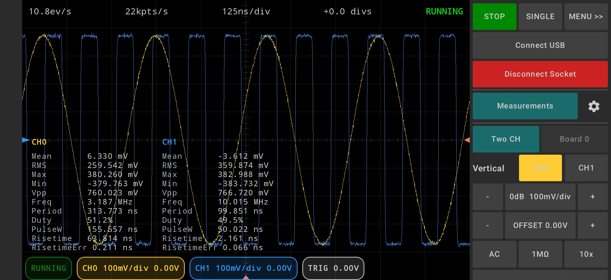
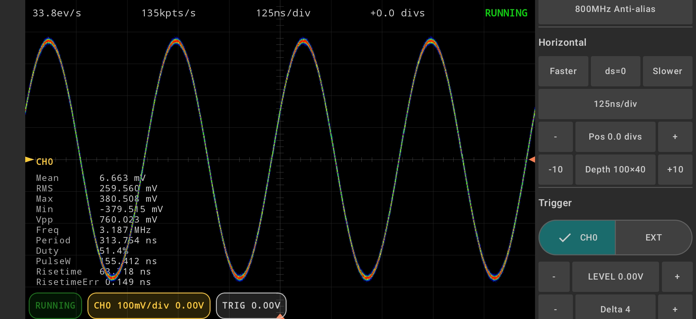
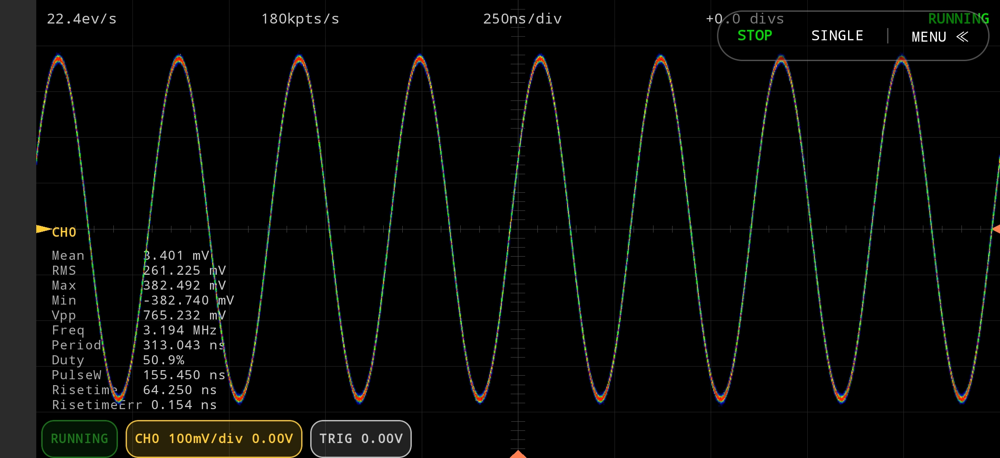
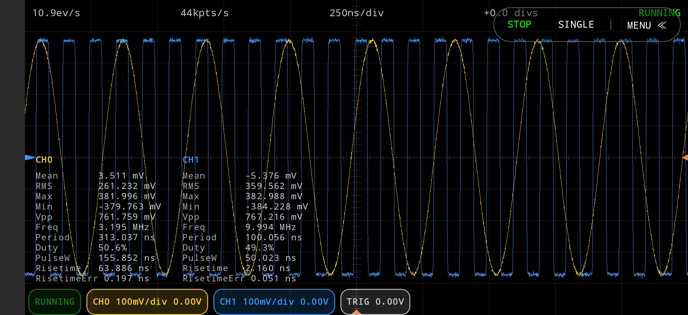

# HaasoscopePro-Android-UI
Third-party Android UI for Haasoscope Pro. Not an official HaasoscopePro project.

An Android UI for HaasoscopePro.

I don't have access to the HaasoscopePro hardware, so I need help from the community to test this application. If you encounter any issues or have suggestions, please open a GitHub Issue or contact me by email.

Your feedback is especially appreciated on:

1. Whether the USB connection and communication with the hardware work correctly.
2. Which UI features are not working as expected.
3. Features or improvements you would like to see added.

Thank you for helping improve this project!

Developed and maintained by **EmbeddedChan**.

## 📥 Download

Last updated: 2026-07-19

[Download EC-FusionKit-v1.13.6.apk](https://github.com/EmbeddedChan/HaasoscopePro-Android-UI/raw/main/apk/EC-FusionKit-v1.13.6.apk)


This app is currently not available on Google Play.

```text
EC FusionKit
│
│
├── HaasoscopePro
│
├── WaveScope(Agilent/KeySight bin viewer)
│
├── Terminals
│   ├── USB Serial Terminal
│   ├── BLE Serial Terminal
│   ├── FTDI Serial Terminal(Dedicated to FTDI USB serial devices)
│   └── SCPI Terminal
│
├── Network
│   ├── UDP
│   ├── TCP Client
│   └── TCP Server
│
└── Utilities
     ├── HEX/BIN/DEC
     ├── FHex Editor
     ├── Calculator
     └── Text File Compare
```

## 🖼 UI Preview










## 📦 Version History

### v1.13.6
- Added FFT.

### v1.13.5
- Added dual-channel support.
- Added full-screen mode.
- Added persistence display.

### v1.13.4
- Initial release
